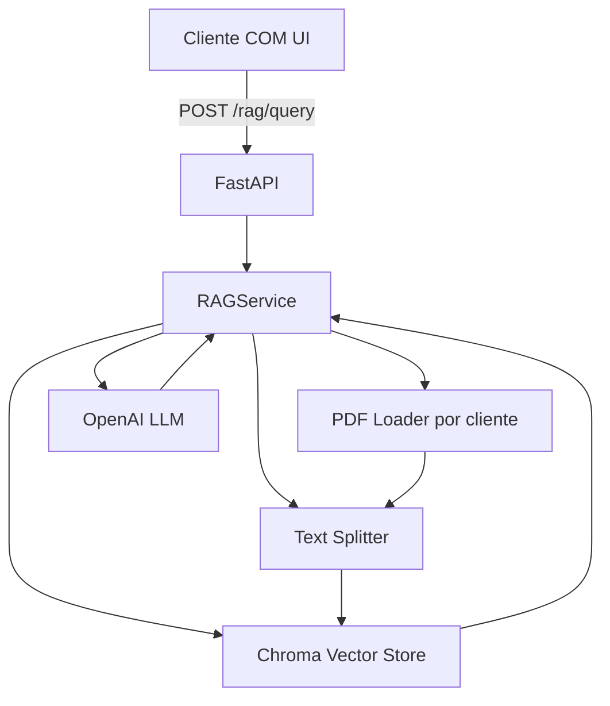

# Backend - Fullstack RAG COM

## Overview / Visión general
English: FastAPI backend offering RAG queries per customer with LangChain, OpenAI, and Chroma as a local vector store.

Español: Backend en FastAPI que expone consultas RAG por cliente usando LangChain, OpenAI y Chroma como vector store local.

## Architecture / Arquitectura


## Tech Stack / Stack técnico
- FastAPI
- LangChain (ChatOpenAI, Chroma, text splitters)
- OpenAI (LLM + embeddings)
- ChromaDB (persistencia local)
- PyPDF Loader / DOCX loader
- Pydantic BaseSettings
<br>Login simulado con credenciales desde variables de entorno.

## Configuration / Configuración
Create a `.env` file under `backend/`:

```
OPENAI_API_KEY=your_key_here
OPENAI_MODEL=gpt-4o-mini
EMBEDDING_MODEL=text-embedding-3-small
DOCS_PATH=../docs
CHROMA_DIR=./chroma_db
CHUNK_SIZE=800
CHUNK_OVERLAP=100
K_RESULTS=5
TEMPERATURE=0.1
ALLOWED_USERNAME=lab.tech
ALLOWED_PASSWORD=secret123
```

## Run locally / Ejecutar en local
```
cd backend
python -m venv .venv
source .venv/bin/activate
pip install -r requirements.txt
uvicorn main:app --reload --host 0.0.0.0 --port 8000
```

## Docker
```
docker build -t fullstack-rag-backend .
docker run -p 8000:8000 --env-file .env fullstack-rag-backend
```

## Folder structure / Estructura
- `main.py`: FastAPI app, routers and CORS.
- `config.py`: Settings with Pydantic BaseSettings.
- `schemas.py`: Request/response models.
- `routers/rag.py`: RAG endpoints.
- `services/rag_service.py`: RAG orchestration (load, split, embed, retrieve, prompt, generate).

## RAG flow / Flujo RAG
1. Login simulado valida usuario/password desde entorno.
2. El usuario carga archivos (PDF/MD/DOCX/TXT) en memoria.
3. Se dividen en chunks con overlap para mejor recall.
4. Se embeddean con OpenAI y se almacenan en Chroma (en memoria para el POC).
5. Se recuperan los top-K chunks relevantes.
6. Se arma prompt y se consulta al modelo en inglés.
7. Se devuelve respuesta con sección de fuentes (archivo y página) y los chunks.

## Security / Seguridad
- No API keys are hardcoded; everything comes from environment variables.
- CORS is open for the MVP; restrict origins in production.
- Input validation through Pydantic schemas and explicit error handling.
